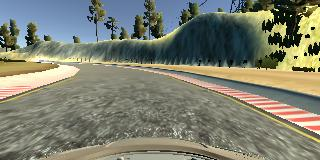
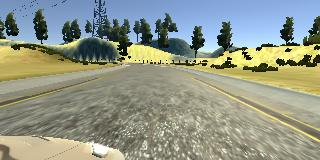
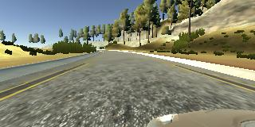

# **Behavioral Cloning**

**Behavioral Cloning Project**

The goals / steps of this project are the following:
* Use the simulator to collect data of good driving behavior
* Build, a convolution neural network in Keras that predicts steering angles from images
* Train and validate the model with a training and validation set
* Test that the model successfully drives around track one without leaving the road
* Summarize the results with a written report

### Model Architecture and Training Strategy

#### 1. An appropriate model architecture has been employed

The model includes RELU layers to introduce nonlinearity (code line 51 or 66), and the data is normalized in the model using a Keras lambda layer (code line 49).

#### 2. Attempts to reduce overfitting in the model

The model was trained and validated on different data sets to ensure that the model was not overfitting (code line 72). The model was tested by running it through the simulator and ensuring that the vehicle could stay on the track.

#### 3. Model parameter tuning

The model used an adam optimizer, so the learning rate was not tuned manually (model.py line 70).

#### 4. Appropriate training data

Training data was chosen to keep the vehicle driving on the road. I used a combination of center lane driving, recovering from the left and right sides of the road to teach the car how to recover to center.

For details about how I created the training data, see the next section.

### Model Architecture and Training Strategy

#### 1. Solution Design Approach

My first step was to use a convolution neural network model similar to the lenet I thought this model might be appropriate because it is a classify model.

In order to gauge how well the model was working, I split my image and steering angle data into a training and validation set. I found that my first model had a low mean squared error on the training set but a high mean squared error on the validation set. This implied that the model was overfitting.

To combat the overfitting, I modified the model so that I can dropout any node of network.

The final step was to run the simulator to see how well the car was driving around track one. There were a few spots where the vehicle fell off the track, to improve the driving behavior in these cases, I add more train data.

At the end of the process, the vehicle is able to drive autonomously around the track without leaving the road.

#### 2. Final Model Architecture

The final model architecture (model.py lines 48-67) consisted of a convolution neural network with the following layers and layer sizes:

|Layer (type)|Output Shape|Param #|Connected to|   
| --------   | -----:   | :----: | :---- |
|cropping2d_1 (Cropping2D)| (None, 90, 320, 3)|0 | cropping2d_input_1[0][0]  |       
|lambda_1 (Lambda)  |              (None, 90, 320, 3)  |  0          | cropping2d_1[0][0] |      
|convolution2d_1 (Convolution2D) | (None, 43, 158, 24) |  1824      |  lambda_1[0][0]  |     
|convolution2d_2 (Convolution2D)  |(None, 20, 77, 36)  |  21636   |   convolution2d_1[0][0]   |  
|convolution2d_3 (Convolution2D)|  (None, 8, 37, 48)   |  43248   |    convolution2d_2[0][0]  |  
|convolution2d_4 (Convolution2D) | (None, 6, 35, 64)   |  27712   |    convolution2d_3[0][0] |    
|convolution2d_5 (Convolution2D) | (None, 4, 33, 64)   |  36928   |    convolution2d_4[0][0] |  
|dropout_1 (Dropout)    |          (None, 4, 33, 64)   |  0       |    convolution2d_5[0][0]|    
|flatten_1 (Flatten)      |        (None, 8448)     |     0        |   dropout_1[0][0]   |   
|dense_1 (Dense)    |              (None, 100)   |        844900 |     flatten_1[0][0]   |  
|dense_2 (Dense)    |              (None, 50)    |        5050   |     dense_1[0][0]     |
|dense_3 (Dense)       |           (None, 10)  |          510     |    dense_2[0][0]     |
|dense_4 (Dense)     |             (None, 1)     |        11      |    dense_3[0][0]  |

#### 3. Creation of the Training Set & Training Process

To capture good driving behavior, I first recorded two laps on track one using center lane driving. Here is an example image of center lane driving:

I then recorded the vehicle recovering from the left side and right sides of the road back to center so that the vehicle would learn to turn.  :

Then I repeated this process on track two in order to get more data points.

After the collection process, I had 15222 number of data points. I then preprocessed this data by cropping.

I finally randomly shuffled the data set and put 20% of the data into a validation set.

I used this training data for training the model. The validation set helped determine if the model was over or under fitting. The ideal number of epochs was 3. I used an adam optimizer so that manually training the learning rate wasn't necessary.
